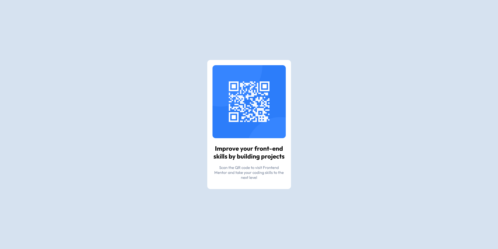

# Frontend Mentor - QR code component solution

This is a solution to the [QR code component challenge on Frontend Mentor](https://www.frontendmentor.io/challenges/qr-code-component-iux_sIO_H). Frontend Mentor challenges help you improve your coding skills by building realistic projects. 

## Table of contents

- [Overview](#overview)
  - [Screenshot](#screenshot)
  - [Links](#links)
- [My process](#my-process)
  - [Built with](#built-with)
  - [What I learned](#what-i-learned)
  - [Continued development](#continued-development)
  - [Useful resources](#useful-resources)
- [Author](#author)
- [Acknowledgments](#acknowledgments)

**Note: Delete this note and update the table of contents based on what sections you keep.**

## Overview

A simple QR Code Card Component using HTML and Less CSS 

### Screenshot



### Links

- Solution URL: [Github Repo](https://github.com/ch-andrew/fm-qr-code-component)
- Live Site URL: [Github Page](https://ch-andrew.github.io/fm-qr-code-component/)

### Built with

- Mobile-first workflow
- Semantic HTML5 markup
- CSS custom properties
- Flexbox
- LESS CSS

### What I learned

In the beginning I wanted to try something new with this project while still using basic html and css without any frameworks. So I decided to use Less CSS for styling, and enjoyed

```css
@border-radius: 12px;
@white: hsl(0, 0%, 100%);
@light-gray: hsl(212, 45%, 89%);
@grayish-blue:hsl(220, 15%, 55%);
@dark-blue:hsl(218, 44%, 22%);
```

## Author

- Website - [ch-andrew](https://github.com/ch-andrew)
- Frontend Mentor - [ch-andrew](https://www.frontendmentor.io/profile/yourusername)

## Acknowledgments

Thank you [Frontend Mentor](https://www.frontendmentor.io) for this challenges that can help me improve my frontend skills
